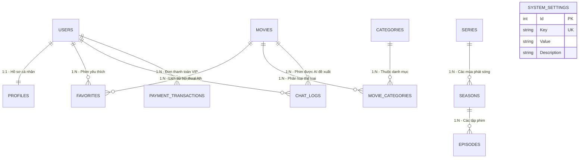

# CineStream - Hệ Sinh Thái Xem Phim Trực Tuyến Đa Nền Tảng

CineStream là hệ sinh thái truyền phát phim trực tuyến hiện đại được xây dựng theo kiến trúc hướng dịch vụ (Service-Oriented Architecture - SOA). Dự án tích hợp hạ tầng truyền phát video thích ứng (Adaptive Bitrate Streaming), cổng thanh toán tự động VietQR SePay, hệ thống quản trị nội dung toàn diện và trợ lý trí tuệ nhân tạo (AI Assistant) hỗ trợ gợi ý phim thông minh theo ngữ cảnh cảm xúc của người dùng.

Hệ thống bao gồm 3 phân hệ chính:
- **Backend API**: Máy chủ dịch vụ xây dựng trên nền tảng ASP.NET Core Web API (.NET 10) và cơ sở dữ liệu PostgreSQL.
- **WebAdmin**: Bảng điều khiển quản trị viên trực quan xây dựng bằng React 18, Vite và Tailwind CSS.
- **Mobile Client**: Ứng dụng xem phim di động đa nền tảng (Android và iOS) xây dựng bằng Flutter.

---

## Mục Lục

1. [Kiến Trúc Hệ Thống](#1-kiến-trúc-hệ-thống)
2. [Các Tính Năng Trọng Tâm](#2-các-tính-năng-trọng-tâm)
3. [Công Nghệ Áp Dụng](#3-công-nghệ-áp-dụng)
4. [Cấu Trúc Thư Mục Dự Án](#4-cấu-trúc-thư-mục-dự-án)
5. [Yêu Cầu Môi Trường Cài Đặt](#5-yêu-cầu-môi-trường-cài-đặt)
6. [Hướng Dẫn Cài Đặt và Khởi Chạy Từng Bước](#6-hướng-dẫn-cài-đặt-và-khởi-chạy-từng-bước)
   - [Bước 1: Clone kho mã nguồn](#bước-1-clone-kho-mã-nguồn)
   - [Bước 2: Cài đặt và cấu hình Cơ sở dữ liệu](#bước-2-cài-đặt-và-cấu-hình-cơ-sở-dữ-liệu)
   - [Bước 3: Khởi chạy Backend API](#bước-3-khởi-chạy-backend-api)
   - [Bước 4: Khởi chạy WebAdmin](#bước-4-khởi-chạy-webadmin)
   - [Bước 5: Khởi chạy Ứng dụng Di động Flutter trên Máy ảo](#bước-5-khởi-chạy-ứng-dụng-di-động-flutter)
7. [Hướng Dẫn Tải và Cài Đặt Kho Phim (Google Drive)](#7-hướng-dẫn-tải-và-cài-đặt-kho-phim-google-drive)
8. [Hướng Dẫn Sử Dụng Tool Băm Phim HLS (split_video.bat)](#8-hướng-dẫn-sử-dụng-tool-băm-phim-hls-split_videobat)
9. [Hướng Dẫn Sử Dụng Hệ Thống Cho Người Dùng và Quản Trị Viên](#9-hướng-dẫn-sử-dụng-hệ-thống-cho-người-dùng-và-quản-trị-viên)
   - [9.1. Dành cho Người dùng cuối (Mobile App Flutter)](#91-dành-cho-người-dùng-cuối-mobile-app-flutter)
   - [9.2. Dành cho Quản trị viên (WebAdmin)](#92-dành-cho-quản-trị-viên-webadmin)
10. [Thiết Kế Cơ Sở Dữ Liệu & Quan Hệ Các Bảng (Database Architecture & ERD)](#10-thiết-kế-cơ-sở-dữ-liệu--quan-hệ-các-bảng-database-architecture--erd)
11. [Tài Khoản và Dữ Liệu Khởi Tạo (Seed Data)](#11-tài-khoản-và-dữ-liệu-khởi-tạo-seed-data)
12. [Kiểm Thử Tự Động (Automated Testing)](#12-kiểm-thử-tự-động-automated-testing)
13. [Bộ Danh Mục API Cốt Lõi](#13-bộ-danh-mục-api-cốt-lõi)

---

## 1. Kiến Trúc Hệ Thống

Hệ thống vận hành theo mô hình Client-Server không trạng thái (Stateless RESTful Architecture), giao tiếp thông qua giao thức HTTP/HTTPS với định dạng dữ liệu chuẩn JSON.

```
+-------------------------------------------------------------------------+
|                              CLIENT APPS                                |
|  - WebAdmin (React 18 + Vite)           [http://localhost:5173]         |
|  - Mobile App (Flutter Android/iOS)                                     |
|  - Scalar Interactive API Reference     [http://localhost:5182/scalar]  |
+------------------------------------+------------------------------------+
                                     |
                                     | RESTful API (JWT Bearer Token)
                                     v
+------------------------------------+------------------------------------+
|                   BACKEND API (.NET 10 WEB API)                         |
|  - Routing, Rate Limiting & Global Exception Handling Middleware        |
|  - Auth & Role-Based Access Control (RBAC: Admin / User)                |
|  - Controllers: Auth, Categories, Movies, Payments, AI, AdminUsers      |
|  - Business Services: AuthService, MovieService, PaymentService, ...    |
|  - Data Access: Entity Framework Core 10, Repositories, AppDbContext    |
+-------------------+--------------------+--------------------+-----------+
                    |                    |                    |
                    v                    v                    v
          +---------+--------+  +--------+--------+  +--------+--------+
          |   PostgreSQL 16  |  | Static Media    |  | External APIs   |
          |   (CineStreamDb) |  | HLS Engine      |  | - Gemini AI     |
          |   - Relational   |  | (wwwroot/       |  | - SePay VietQR  |
          |   - Soft Delete  |  |  videos/*.m3u8) |  | - Gmail SMTP    |
          +------------------+  +-----------------+  +-----------------+
```

---

## 2. Các Tính Năng Trọng Tâm

### 2.1. Hạ Tầng Truyền Phát Video Kép (Dual-Streaming Infrastructure)
- **HLS Phân Đoạn Công Nghiệp (HTTP Live Streaming - RFC 8216)**: Video được phân đoạn thành các tệp `.ts` độ dài tối ưu kèm danh sách phát `master.m3u8`, hỗ trợ tua mượt mà và tiết kiệm băng thông mạng.
- **Direct CDN MP4**: Hỗ trợ phát luồng trực tiếp từ các máy chủ đám mây (Google Cloud Storage) đối với các nội dung lưu trữ ngoài.

### 2.2. Trợ Lý AI Điện Ảnh Thông Minh (CineBot)
- Tích hợp mô hình Google Gemini qua giao thức REST API.
- **Kỹ thuật In-Context Semantic Injection**: Trước khi gửi câu hỏi tới AI, hệ thống tự động truy vấn danh mục phim hiện có trong cơ sở dữ liệu để đưa vào ngữ cảnh hệ thống (System Prompt), giúp AI tư vấn phim chuẩn xác theo cốt truyện, thể loại và cảm xúc của người dùng.
- Tự động lưu vết lịch sử hội thoại (Chat History) theo từng tài khoản.

### 2.3. Cổng Thanh Toán Tự Động VietQR SePay với Cơ Chế Dual-Sync
- **Sinh mã VietQR Napas động**: Tự động mã hóa ngân hàng, số tài khoản, số tiền và mã đơn hàng định danh duy nhất (`CINE...`).
- **Cơ chế đồng bộ kép (Dual-Sync)**:
  - *Kênh đẩy (Push - Webhook)*: SePay gửi thông báo biến động số dư khi có giao dịch chuyển khoản thành công.
  - *Kênh kéo (Pull - Polling Fallback)*: Trong môi trường phát triển cục bộ (`localhost`) hoặc khi Webhook bị trễ mạng, luồng kiểm tra trạng thái từ Client tự động truy vấn trực tiếp SePay Open API để đối soát số tiền và nội dung, tự động kích hoạt gói VIP cho người dùng chỉ sau 2-3 giây.
- **Quản trị giá gói VIP linh hoạt**: Bảng giá các gói cước (1 Tháng, 3 Tháng, 1 Năm) được lưu trữ động trong bảng cấu hình `SystemSettings`, cho phép Quản trị viên sửa giá trực tiếp dạng Inline trên WebAdmin mà không cần can thiệp mã nguồn.

### 2.4. Bảo Mật và Toàn Vẹn Dữ Liệu Doanh Nghiệp
- **Xác thực và phân quyền (RBAC)**: Cấp phát JSON Web Token (JWT) có mã hóa Claim vai trò (`Admin`, `User`).
- **Bảo toàn dữ liệu (Data Integrity)**: Cơ chế kiểm tra ràng buộc trước khi xóa thể loại; chặn xóa thể loại nếu còn phim liên kết và phản hồi lỗi HTTP 400 chi tiết.
- **Xóa mềm (Soft Delete)**: Tự động lọc các bản ghi đã xóa bằng Global Query Filter của EF Core, bảo vệ dữ liệu khỏi các thao tác xóa nhầm.

---

## 3. Công Nghệ Áp Dụng

| Phân hệ | Công nghệ / Thư viện | Vai trò |
| :--- | :--- | :--- |
| **Backend Core** | C# 13, .NET 10 (ASP.NET Core Web API) | Xây dựng API dịch vụ, logic nghiệp vụ trung tâm |
| **Cơ sở dữ liệu** | PostgreSQL 16+ | Lưu trữ dữ liệu quan hệ, chỉ mục tìm kiếm |
| **ORM** | Entity Framework Core 10, Npgsql | Truy vấn cơ sở dữ liệu theo phương pháp Code-First |
| **Bảo mật** | JWT Bearer, BCrypt.Net-Next | Xác thực không trạng thái và mã hóa mật khẩu an toàn |
| **Trí tuệ nhân tạo** | Google Gemini REST API | Phân tích ngôn ngữ tự nhiên và tư vấn phim |
| **Cổng thanh toán** | VietQR Napas API, SePay Open API | Tạo mã QR và đối soát biến động số dư tự động |
| **Tài liệu API** | Scalar API Reference, Microsoft OpenAPI | Giao diện kiểm thử và tài liệu hóa chuẩn OpenAPI 3.0 |
| **WebAdmin** | React 18, Vite, Tailwind CSS, Lucide Icons | Giao diện quản trị phim, danh mục, người dùng và bảng giá |
| **Mobile Client** | Flutter SDK 3.x (Dart), Dio, VideoPlayer | Ứng dụng xem phim đa nền tảng cho người dùng cuối |
| **Kiểm thử** | xUnit, .NET Test SDK | Bộ kiểm thử đơn vị tự động theo phương pháp TDD |

---

## 4. Cấu Trúc Thư Mục Dự Án

```
CineStream/
|-- Backend/                            # Máy chủ ASP.NET Core Web API (.NET 10)
|   |-- Controllers/                    # Các bộ điều khiển tiếp nhận HTTP Request
|   |-- Data/                           # AppDbContext, DataSeeder khởi tạo dữ liệu
|   |-- DTOs/                           # Data Transfer Objects cho từng phân hệ
|   |-- Middlewares/                    # Exception Handling Middleware toàn cục
|   |-- Models/                         # Thực thể cơ sở dữ liệu (Movie, User, ...)
|   |-- Repositories/                   # Tầng truy xuất dữ liệu theo Repository Pattern
|   |-- Services/                       # Tầng xử lý logic nghiệp vụ trung tâm
|   |-- wwwroot/                        # Thư mục chứa video phân đoạn HLS (.m3u8, .ts)
|   |-- split_video.bat                 # Tool băm phim MP4 sang định dạng HLS tự động
|   |-- appsettings.json                # Tệp cấu hình kết nối CSDL, JWT, Gemini, SePay
|   +-- Program.cs                      # Cấu hình Dependency Injection và Middleware
|
|-- Backend.Tests/                      # Bộ kiểm thử tự động (111 unit tests)
|   |-- Admin/                          # Kiểm thử tính năng quản trị người dùng
|   |-- AI/                             # Kiểm thử phân quyền và nạp ngữ cảnh AI
|   |-- Categories/                     # Kiểm thử logic ràng buộc khi xóa thể loại
|   |-- Movies/                         # Kiểm thử lọc, tìm kiếm và phân trang phim
|   +-- Payments/                       # Kiểm thử bảng giá động và SePay Polling Fallback
|
|-- Frontend/
|   |-- WebAdmin/                       # Trang quản trị React 18 + Vite + Tailwind CSS
|   |   |-- src/api/                    # Các module gọi API Backend (axios)
|   |   |-- src/components/             # Modal, Dialog xác nhận, Protected Route
|   |   |-- src/pages/                  # Dashboard, Movies, Categories, Subscriptions, Users
|   |   +-- package.json                # Danh sách thư viện frontend
|   |
|   +-- cinestream_mobile/              # Ứng dụng di động xem phim đa nền tảng Flutter
|       |-- lib/core/                   # Cấu hình API client, theme, hằng số hệ thống
|       |-- lib/models/                 # Data model phía client
|       |-- lib/screens/                # Màn hình xem phim, thanh toán QR, chat AI
|       |-- lib/services/               # Dịch vụ gọi API Backend
|       +-- pubspec.yaml                # Cấu hình dependencies Flutter
|
+-- README.md                           # Tài liệu hướng dẫn tổng quan dự án
```

---

## 5. Yêu Cầu Môi Trường Cài Đặt

Trước khi tiến hành cài đặt, máy tính của bạn cần được cài đặt sẵn các công cụ sau:

1. **.NET SDK 10.0**: Kiểm tra bằng lệnh `dotnet --version`.
2. **Node.js 18+ và npm**: Kiểm tra bằng lệnh `node -v` và `npm -v`.
3. **Flutter SDK 3.x**: Kiểm tra bằng lệnh `flutter --version` và `flutter doctor`.
4. **PostgreSQL 16+**: Hệ quản trị cơ sở dữ liệu đang hoạt động trên cổng mặc định `5432`.
5. **FFmpeg**: Phục vụ công cụ băm phim HLS. Kiểm tra bằng lệnh `ffmpeg -version`.
6. **Git**: Công cụ quản lý mã nguồn.

---

## 6. Hướng Dẫn Cài Đặt và Khởi Chạy Từng Bước

### Bước 1: Clone kho mã nguồn

Mở terminal hoặc Git Bash trên máy tính và chạy lệnh:

```bash
git clone https://github.com/ducanh295/CineStream.git
cd CineStream
```

---

### Bước 2: Cài đặt và cấu hình Cơ sở dữ liệu

1. **Tạo cơ sở dữ liệu PostgreSQL**:
   Mở công cụ pgAdmin hoặc terminal `psql` và tạo một cơ sở dữ liệu mới có tên `CineStreamDb`:
   ```sql
   CREATE DATABASE "CineStreamDb";
   ```

2. **Cập nhật chuỗi kết nối trong Backend**:
   Mở tệp `Backend/appsettings.json` và cập nhật thông tin tài khoản PostgreSQL của bạn tại mục `ConnectionStrings`:
   ```json
   {
     "ConnectionStrings": {
       "DefaultConnection": "Host=localhost;Port=5432;Database=CineStreamDb;Username=postgres;Password=mat_khau_cua_ban"
     },
     "JWT": {
       "Key": "your-super-secret-key-at-least-32-characters-long",
       "Issuer": "CineStream",
       "Audience": "CineStreamApp",
       "ExpireMinutes": 60
     },
     "Gemini": {
       "ApiKey": "YOUR_GEMINI_API_KEY",
       "Model": "gemini-3.5-flash-lite",
       "BaseUrl": "https://generativelanguage.googleapis.com/v1beta"
     },
     "SePay": {
       "BankName": "MB",
       "AccountNumber": "0385941522",
       "AccountName": "NGUYEN KHAC DUC ANH",
       "ApiKey": "YOUR_SEPAY_API_KEY"
     }
   }
   ```

> Lưu ý: Hệ thống đã tích hợp cơ chế tự động khởi tạo bảng (`Database.EnsureCreated()`) và nạp dữ liệu mẫu (`DataSeeder`) ngay khi khởi động, bạn không cần phải chạy lệnh Migration thủ công.

---

### Bước 3: Khởi chạy Backend API

Di chuyển vào thư mục `Backend` và tiến hành biên dịch, khởi chạy:

```bash
cd Backend

# Khôi phục các gói thư viện
dotnet restore

# Biên dịch kiểm tra lỗi
dotnet build

# Khởi chạy dịch vụ API
dotnet run
```

Sau khi khởi chạy thành công, máy chủ lắng nghe tại:
- **Địa chỉ API chính**: `http://localhost:5182`
- **Tài liệu kiểm thử Scalar API Reference**: `http://localhost:5182/scalar/v1`
- **Đặc tả OpenAPI JSON**: `http://localhost:5182/openapi/v1.json`

---

### Bước 4: Khởi chạy WebAdmin

Mở một cửa sổ Terminal mới và di chuyển vào thư mục `Frontend/WebAdmin`:

```bash
cd Frontend/WebAdmin

# Cài đặt các thư viện phụ thuộc
npm install

# Khởi chạy máy chủ phát triển
npm run dev
```

Sau khi khởi chạy, mở trình duyệt truy cập:
- **Địa chỉ giao diện**: `http://localhost:5173`

---

### Bước 5: Khởi chạy Ứng dụng Di động Flutter

Di chuyển vào thư mục dự án ứng dụng di động:

```bash
cd Frontend/cinestream_mobile

# Tải các gói thư viện Flutter cần thiết
flutter pub get
```

#### 5.1. Khởi động Máy ảo (Android Emulator / iOS Simulator)

Bạn có thể khởi động máy ảo theo 1 trong 3 cách thuận tiện sau:

- **Cách 1: Khởi động nhanh từ dòng lệnh Terminal (Khuyên dùng)**:
  ```bash
  # Xem danh sách máy ảo đã cài đặt trên máy
  flutter emulators

  # Khởi động máy ảo theo ID (ví dụ máy ảo Pixel_7)
  flutter emulators --launch Pixel_7
  ```

- **Cách 2: Khởi động từ Visual Studio Code**:
  1. Nhấn tổ hợp phím `Ctrl + Shift + P` (hoặc `Cmd + Shift + P` trên macOS).
  2. Nhập tìm kiếm và chọn lệnh: `Flutter: Launch Emulator`.
  3. Chọn thiết bị máy ảo mong muốn từ danh sách xuất hiện (ví dụ: `Pixel 7`).

- **Cách 3: Khởi động từ Android Studio**:
  1. Mở phần mềm Android Studio.
  2. Truy cập thanh công cụ bên phải hoặc menu: **Tools** -> **Device Manager**.
  3. Nhấn vào biểu tượng nút **Run/Play** tại máy ảo bạn muốn bật.

#### 5.2. Khởi chạy Ứng dụng lên Máy ảo

1. **Kiểm tra kết nối thiết bị**:
   Sau khi máy ảo đã khởi động xong hoàn toàn, chạy lệnh để xác nhận thiết bị đã được nhận diện:
   ```bash
   flutter devices
   ```
   Hệ thống sẽ hiển thị thiết bị đang hoạt động (ví dụ: `Android SDK built for x86_64 • emulator-5554 • android-x64`).

2. **Chạy ứng dụng**:
   ```bash
   flutter run
   ```
   *Mẹo*: Nếu máy tính của bạn đang kết nối đồng thời nhiều thiết bị, chỉ định đích danh máy ảo bằng tham số `-d`:
   ```bash
   flutter run -d emulator-5554
   ```

3. **Các phím tắt điều khiển khi chạy**:
   - Nhấn phím `r`: **Hot Reload** (cập nhật thay đổi giao diện ngay lập tức trong 1 giây mà không mất trạng thái hiện tại).
   - Nhấn phím `R`: **Hot Restart** (khởi động lại toàn bộ logic ứng dụng).
   - Nhấn phím `q`: Dừng và thoát ứng dụng.

> **Cơ chế mạng đặc biệt của Android Emulator**:
> - Máy ảo Android chạy trong môi trường ảo hóa độc lập. Khi máy ảo gọi đến `localhost`, nó sẽ tự trỏ vào chính nó thay vì máy tính của bạn.
> - Do đó, Android Emulator quy định địa chỉ **`10.0.2.2`** là cổng kết nối đặc biệt ánh xạ trực tiếp về `localhost` của máy tính.
> - Dự án CineStream đã thiết lập tự động cơ chế này trong tệp `lib/core/constants/api_constants.dart` (`http://10.0.2.2:5182/api`), do đó bạn không cần phải thay đổi mã nguồn khi chạy trên máy ảo Android.
> - Trường hợp chạy trên **Thiết bị thật (cắm cáp USB hoặc chung WiFi)**: Thay đổi `baseUrl` thành địa chỉ IPv4 nội bộ của máy tính bạn (ví dụ: `http://192.168.1.15:5182/api`).

---

## 7. Hướng Dẫn Tải và Cài Đặt Kho Phim (Google Drive)

Nhằm đảm bảo kho mã nguồn Git luôn nhẹ nhàng và tối ưu tốc độ clone dự án, toàn bộ các tệp video độ phân giải cao được lưu trữ tập trung tại Google Drive.

### 7.1. Tải gói dữ liệu phim

- **Đường dẫn tải kho phim đầy đủ**: [Tải Full Kho Phim CineStream (Google Drive)](https://drive.google.com/file/d/1-kCoZi6fNyT1F-8JeFRzeU3rmfjjvODU/view?usp=sharing)
- **Tên tệp**: `videos.zip` (Khoảng 3.4 GB)
- **Nội dung bao gồm**:
  - `Dai_thoai_tay_du/`: Phim kinh điển Đại Thoại Tây Du (Châu Tinh Trì), định dạng HLS trọn bộ 106 phút.
  - `lao_dao_hoa/`: Phim hành động Lão Đạo Hỏa, định dạng HLS trọn bộ 98 phút.
  - `Demo_2/`: Hoạt hình Big Buck Bunny và Elephant's Dream định dạng HLS chuẩn HD.
  - `demo001/`: Luồng video thử nghiệm HLS.

### 7.2. Các bước cài đặt vào dự án

1. **Bước 1**: Nhấp vào đường dẫn Google Drive ở trên và tải tệp `videos.zip` về máy tính của bạn.
2. **Bước 2**: Nhấp chuột phải vào `videos.zip` và chọn **Extract Here** (hoặc giải nén bằng WinRAR / 7-Zip).
3. **Bước 3**: Sao chép toàn bộ các thư mục vừa giải nén (`Dai_thoai_tay_du`, `lao_dao_hoa`, `Demo_2`, `demo001`...) và dán trực tiếp vào thư mục:
   ```
   Backend/wwwroot/videos/
   ```
4. **Bước 4**: Kiểm tra cấu trúc thư mục sau khi giải nén đảm bảo đúng định dạng như sau:
   ```
   Backend/
   └── wwwroot/
       ├── player.html
       └── videos/
           ├── Dai_thoai_tay_du/
           │   ├── master.m3u8
           │   ├── master0.ts
           │   └── ...
           ├── lao_dao_hoa/
           │   ├── master.m3u8
           │   ├── master0.ts
           │   └── ...
           ├── Demo_2/
           │   ├── master.m3u8
           │   ├── master0.ts
           │   └── ...
           └── demo001/
               ├── master.m3u8
               └── ...
   ```
5. **Bước 5**: Kiểm tra phát thử luồng HLS. Bạn có thể mở trình duyệt truy cập:
   ```
   http://localhost:5182/player.html
   ```
   Nhập đường dẫn `/videos/Dai_thoai_tay_du/master.m3u8` hoặc `/videos/Demo_2/master.m3u8` để kiểm tra khả năng phát video trước khi chạy ứng dụng di động.

---

## 8. Hướng Dẫn Sử Dụng Tool Băm Phim HLS (`split_video.bat`)

Công cụ `Backend/split_video.bat` được xây dựng nhằm tự động hóa quy trình phân đoạn video MP4 thành định dạng chuẩn công nghiệp HTTP Live Streaming (HLS RFC 8216) phục vụ hệ thống streaming nội bộ của CineStream.

### 7.1. Lợi ích của việc băm phim sang HLS
- **Tối ưu băng thông**: Trình phát chỉ tải từng đoạn nhỏ 6 giây (`.ts`) thay vì tải cả tệp MP4 hàng gigabyte.
- **Tua phim tức thì**: Người dùng có thể nhảy tới bất kỳ mốc thời gian nào mà không phải chờ tải trước toàn bộ video.
- **Bảo mật nội dung**: Chống lộ trực tiếp đường dẫn tệp MP4 gốc trên máy chủ.
- **Hỗ trợ đa định dạng video**: Tự động chuyển đổi các codec video phức tạp (như VP9, AV1 từ YouTube) về chuẩn H.264 tương thích 100% với cả Web lẫn ứng dụng di động.

### 7.2. Yêu cầu tiên quyết
- Máy tính đã cài đặt **FFmpeg** và thêm vào biến môi trường `PATH`. Kiểm tra bằng lệnh:
  ```bash
  ffmpeg -version
  ```
- *Tăng tốc phần cứng (Tùy chọn)*: Hỗ trợ card đồ họa NVIDIA (NVENC) để mã hóa siêu tốc. Nếu máy tính không có card NVIDIA, script sẽ tự động nhận diện và chuyển sang mã hóa bằng CPU (`libx264`).

### 7.3. Cách sử dụng công cụ băm phim

Bạn có thể thực hiện theo 1 trong 2 cách sau:

**Cách 1: Kéo thả trực quan (Khuyên dùng)**
1. Mở thư mục `Backend/` trong Windows Explorer.
2. Kéo trực tiếp tệp phim định dạng `.mp4` của bạn và thả vào tệp `split_video.bat`.
3. Cửa sổ Command Prompt xuất hiện, hiển thị tên video đầu vào.
4. Nhập tên thư mục muốn lưu trữ (hoặc nhấn `ENTER` để lấy theo tên tệp mặc định).
5. Quá trình băm phim tự động diễn ra. Khi hoàn tất, tệp danh sách phát `master.m3u8` và các mảnh video `.ts` sẽ được sinh ra tại thư mục:
   ```
   Backend/wwwroot/videos/<ten_thu_muc>/
   ```

**Cách 2: Chạy từ dòng lệnh Terminal**
```cmd
cd Backend
split_video.bat "D:\Videos\my_movie.mp4"
```

### 7.4. Hướng dẫn gán luồng HLS vào phim trên WebAdmin
1. Đăng nhập trang quản trị WebAdmin (`http://localhost:5173`).
2. Vào mục **Quản lý phim** -> Bấm **Thêm phim mới** (hoặc Sửa phim có sẵn).
3. Tại ô nhập **Video URL**, bấm nút **"Kho HLS nội bộ"**:
   - Hệ thống hiển thị danh sách các thư mục phim đã được băm sẵn trong thư mục `wwwroot/videos/`.
   - Nhấp chuột chọn thư mục phim bạn vừa băm (ví dụ: `my_movie`).
   - Đường dẫn `/videos/my_movie/master.m3u8` sẽ được tự động điền vào ô Video URL chỉ bằng 1 cú nhấp chuột.
4. Điền các thông tin khác (Tên phim, mô tả, ảnh poster, thể loại) và bấm **Lưu thay đổi**.

### 7.5. Kiểm tra phát thử luồng HLS trực tiếp
Sau khi băm phim xong, bạn có thể kiểm tra trực tiếp khả năng phát luồng HLS trên trình duyệt bằng cách truy cập:
```
http://localhost:5182/player.html
```
Dán đường dẫn HLS (ví dụ: `/videos/my_movie/master.m3u8`) và bấm phát để kiểm tra chất lượng video, phụ đề và khả năng tua thời gian.

---

## 9. Hướng Dẫn Sử Dụng Hệ Thống Cho Người Dùng và Quản Trị Viên

### 9.1. Dành cho Người dùng cuối (Mobile App Flutter)

1. **Đăng ký và Đăng nhập**:
   - Mở ứng dụng CineStream trên điện thoại hoặc máy ảo.
   - Bấm "Đăng ký" nếu chưa có tài khoản, hoặc nhập tài khoản người dùng thử nghiệm: `user@cinestream.com` / `User@123`.
2. **Khám phá và Xem phim**:
   - Màn hình chính hiển thị Banner phim mới nhất, các hàng danh mục phim theo thể loại (Hành Động, Viễn Tưởng, Hoạt Hình, ...).
   - Nhấn vào bộ phim bất kỳ để xem chi tiết: diễn viên, đạo diễn, điểm đánh giá, tóm tắt cốt truyện.
   - Bấm **"Xem phim ngay"**: Trình phát Video Player tích hợp sẽ tự động nhận diện luồng phát (HLS hoặc MP4), hỗ trợ phóng to toàn màn hình, tua tiến/lùi 10 giây, điều chỉnh âm lượng và độ sáng.
3. **Nâng cấp gói tài khoản VIP (VietQR SePay)**:
   - Vào mục **Tài khoản** -> Chọn **Nâng cấp VIP**.
   - Chọn gói dịch vụ mong muốn (Gói 1 Tháng, 3 Tháng hoặc 1 Năm).
   - Màn hình hiển thị mã QR VietQR Napas chuẩn ngân hàng kèm thông tin chuyển khoản (Số tiền, số tài khoản MBBank, nội dung chuyển khoản `CINE...`).
   - Mở ứng dụng ngân hàng hoặc MoMo trên điện thoại và quét mã QR để chuyển khoản.
   - Nhờ cơ chế **Dual-Sync Polling Fallback**, chỉ sau 2-3 giây kể từ khi ngân hàng báo chuyển tiền thành công, ứng dụng CineStream sẽ tự động phát hiện, chúc mừng và nâng cấp tài khoản của bạn lên VIP với đầy đủ quyền lợi.
4. **Trò chuyện cùng Trợ lý AI CineBot**:
   - Nhấn vào biểu tượng Chat AI trên thanh điều hướng.
   - Nhập cảm xúc hoặc mong muốn (ví dụ: *"Tôi đang buồn, hãy gợi ý cho tôi một bộ phim hài nhẹ nhàng của Châu Tinh Trì"*).
   - Trợ lý AI CineBot sẽ phân tích ngữ cảnh, đối soát với kho phim thực tế của CineStream và đưa ra lời khuyên phù hợp kèm nút chuyển nhanh đến bộ phim được gợi ý.

---

### 9.2. Dành cho Quản trị viên (WebAdmin)

1. **Đăng nhập Quản trị viên**:
   - Truy cập `http://localhost:5173/login`.
   - Đăng nhập bằng tài khoản: `admin@cinestream.com` / `Admin@123`.
2. **Bảng điều khiển (Dashboard)**:
   - Theo dõi tổng số phim, tổng số thể loại, tổng số người dùng và tổng doanh thu nạp VIP theo thời gian thực.
3. **Quản lý Thể loại (Categories)**:
   - Thêm thể loại mới, chỉnh sửa mô tả.
   - Bảng hiển thị cột **Số lượng phim** đang liên kết với từng thể loại.
   - **Cơ chế bảo vệ dữ liệu**: Nếu một thể loại đang có phim liên kết, hệ thống sẽ cảnh báo và chặn thao tác xóa nhằm bảo đảm toàn vẹn dữ liệu hệ thống.
4. **Quản lý Phim (Movies)**:
   - Thêm phim mới, chỉnh sửa thông tin, đổi ảnh bìa, phân loại nhiều danh mục cho phim.
   - Chọn nguồn video: Nhập link CDN MP4 hoặc bấm nút "Kho HLS nội bộ" để chọn thư mục phim đã băm bằng `split_video.bat`.
5. **Quản trị Bảng giá gói VIP (Subscriptions)**:
   - Trang hiển thị bảng giá niêm yết các gói VIP (1 Tháng, 3 Tháng, 1 Năm).
   - **Tính năng sửa giá nhanh Inline**: Bấm nút **"Sửa giá"** ngay trên thẻ gói VIP, nhập số tiền mới (tối thiểu từ 1.000 VNĐ), nhấn `Enter` để lưu hoặc `Esc` để hủy. Giá mới sẽ ngay lập tức được áp dụng cho mọi đơn hàng tạo mới trên cả WebAdmin lẫn Mobile App.
   - **Lịch sử giao dịch**: Xem danh sách toàn bộ các giao dịch nạp tiền, lọc theo trạng thái (Chờ thanh toán, Thành công, Thất bại), kiểm tra mã giao dịch ngân hàng.
   - **Mô phỏng thanh toán (Demo)**: Cho phép Quản trị viên bấm nút "Mô phỏng thanh toán thành công" đối với bất kỳ đơn hàng nào đang ở trạng thái Pending để phục vụ việc bảo vệ đồ án hoặc kiểm thử mà không cần thực sự chuyển tiền ngân hàng.
6. **Quản lý Người dùng (Users)**:
   - Xem danh sách thành viên hệ thống, ngày tham gia, vai trò và trạng thái VIP.
   - Khóa tài khoản vi phạm kèm lý do, mở khóa tài khoản.
   - Điều chỉnh hoặc cấp thời hạn VIP thủ công cho từng người dùng.

---

## 10. Thiết Kế Cơ Sở Dữ Liệu & Quan Hệ Các Bảng (Database Architecture & ERD)

Hệ thống cơ sở dữ liệu của CineStream được xây dựng trên hệ quản trị **PostgreSQL** kết hợp cùng công nghệ **Entity Framework Core 10 (Code-First)**. Thiết kế tuân thủ nghiêm ngặt các quy tắc chuẩn hóa dữ liệu (Chuẩn 3NF), tối ưu hóa chỉ mục (Indexes) và áp dụng cơ chế xóa mềm (**Soft Delete**) kế thừa từ lớp `BaseEntity`.

### 10.1. Sơ đồ Quan Hệ Thực Thể (ERD - Entity Relationship Diagram)



### 10.2. Chi tiết Danh Mục Các Bảng và Ràng Buộc Dữ Liệu

Mọi bảng trong hệ thống (ngoại trừ bảng liên kết nhiều-nhiều) đều kế thừa từ lớp cơ sở `BaseEntity`:
- `Id`: Khóa chính định danh duy nhất (Primary Key).
- `CreatedAt`: Thời điểm khởi tạo bản ghi (UTC).
- `UpdatedAt`: Thời điểm cập nhật bản ghi gần nhất (UTC).
- `IsDeleted`: Trạng thái xóa mềm (`true` = đã xóa, `false` = đang hoạt động).
- `DeletedAt`: Thời điểm thực hiện xóa bản ghi.

Hệ thống tự động cấu hình **Global Query Filter** (`HasQueryFilter(e => !e.IsDeleted)`) cho toàn bộ các bảng, đảm bảo các bản ghi đã xóa mềm không bao giờ bị lộ ra ngoài giao diện người dùng.

| Tên Bảng | Vai Trò & Mục Đích Nghiệp Vụ | Các Thuộc Tính Cốt Lõi | Ràng Buộc & Khóa Ngoại |
| :--- | :--- | :--- | :--- |
| **Users** | Lưu trữ thông tin tài khoản người dùng, phân quyền truy cập và gói thuê bao | `Id`, `Email`, `Username`, `PasswordHash`, `Role` (Admin/User), `IsEmailConfirmed`, `IsVip`, `VipExpireAt`, `IsLocked`, `LockReason` | `Email` (Unique Index), `Username` (Unique Index) |
| **Profiles** | Chứa thông tin hồ sơ hiển thị công khai của người dùng | `Id`, `UserId`, `DisplayName`, `AvatarUrl`, `Bio` | `UserId` (FK trỏ tới `Users.Id`, Unique Index quan hệ 1 - 1) |
| **Categories** | Quản lý danh mục thể loại phim | `Id`, `Name`, `Description` | `Name` (Unique Index). Chặn xóa nếu còn phim liên kết |
| **Movies** | Lưu trữ dữ liệu phim (phim lẻ và phim bộ), đường dẫn phát HLS và trạng thái | `Id`, `Title`, `Description`, `PosterUrl`, `TrailerUrl`, `VideoUrl`, `Duration`, `ReleaseYear`, `Type` (Single/Series), `VideoStatus`, `IsFeatured`, `PublishStatus` | Liên kết với `MovieCategories` và `Favorites` |
| **MovieCategories** | Bảng nối quan hệ nhiều - nhiều (N - N) giữa phim và thể loại | `MovieId`, `CategoryId` | Khóa chính kép `(MovieId, CategoryId)`. FK trỏ tới `Movies.Id` và `Categories.Id` |
| **Favorites** | Quản lý danh sách các bộ phim được người dùng bấm "Yêu thích" | `UserId`, `MovieId`, `CreatedAt` | Khóa chính kép `(UserId, MovieId)`. FK trỏ tới `Users.Id` và `Movies.Id` |
| **Series** | Quản lý thông tin tổng quan của các bộ phim dài tập (Phim truyền hình) | `Id`, `Title`, `Description`, `PosterUrl`, `TrailerUrl` | Liên kết 1 - N với bảng `Seasons` |
| **Seasons** | Quản lý từng mùa phát sóng của phim bộ | `Id`, `SeriesId`, `SeasonNumber`, `Title` | FK `SeriesId` trỏ tới `Series.Id` |
| **Episodes** | Quản lý từng tập phim cụ thể trong mùa | `Id`, `SeasonId`, `EpisodeNumber`, `Title`, `VideoUrl`, `Duration` | FK `SeasonId` trỏ tới `Seasons.Id` |
| **ChatLogs** | Lưu trữ lịch sử tương tác giữa người dùng và Trợ lý AI CineBot | `Id`, `UserId`, `Role` (user/model), `Message`, `SuggestedMovieId` | FK `UserId` trỏ tới `Users.Id` (Index), FK `SuggestedMovieId` trỏ tới `Movies.Id` (Nullable) |
| **PaymentTransactions** | Lưu trữ nhật ký đơn hàng và lịch sử giao dịch nạp VIP VietQR SePay | `Id`, `UserId`, `OrderCode`, `PlanType`, `Amount`, `Status` (Pending/Success/Failed), `BankName`, `AccountNumber`, `TransactionContent`, `PaidAt`, `ReferenceCode` | `OrderCode` (Unique Index để tra cứu và webhook bảo mật), FK `UserId` trỏ tới `Users.Id` (Index) |
| **SystemSettings** | Quản lý các tham số cấu hình hệ thống động (giá gói VIP, SePay API...) | `Id`, `Key`, `Value`, `Description` | `Key` (Unique Index phục vụ truy vấn O(1) cấu hình) |

> **Ghi chú kiến trúc về Phim bộ (Series / Seasons / Episodes)**:
> Hệ thống áp dụng tư duy thiết kế đón đầu (Future-Proof Architecture). Tầng Cơ sở dữ liệu đã chuẩn hóa và sẵn sàng cấu trúc phân cấp 3 tầng (`Series` -> `Seasons` -> `Episodes`) phục vụ phát sóng phim truyền hình nhiều tập trong Giai đoạn 2 (Roadmap). Trong phiên bản hiện tại (Giai đoạn 1 - MVP 1.0), toàn bộ danh mục phim được hợp nhất quản trị và tối ưu luồng phát qua bảng trung tâm `Movies` (kèm trường phân loại `MovieType: Single / Series`) nhằm tập trung giải quyết xuất sắc các bài toán công nghệ cốt lõi: hạ tầng HLS phân đoạn 6s, thanh toán tự động VietQR SePay và trợ lý trí tuệ nhân tạo Gemini AI.

---

## 11. Tài Khoản và Dữ Liệu Khởi Tạo (Seed Data)

Khi khởi động lần đầu, hệ thống tự động nạp sẵn các tài khoản và nội dung phim phục vụ kiểm thử và thuyết trình:

### 11.1. Tài khoản mặc định

| Vai trò | Email đăng nhập | Mật khẩu | Đặc quyền |
| :--- | :--- | :--- | :--- |
| **Quản trị viên (Admin)** | `admin@cinestream.com` | `Admin@123` | Toàn quyền quản trị phim, thể loại, người dùng, xem toàn bộ giao dịch, sửa giá gói VIP |
| **Người dùng thường (User)** | `user@cinestream.com` | `User@123` | Xem phim thường, trò chuyện với trợ lý AI, nạp tiền mua gói VIP |

### 11.2. Dữ liệu phim và cơ chế phát mẫu (Streaming Playback)

Hệ thống có sẵn 6 bộ phim mẫu được khởi tạo tự động trong cơ sở dữ liệu (`DataSeeder.cs`), đại diện cho nhiều thể loại:

| STT | Tên phim | Thể loại | Đường dẫn luồng phát HLS |
| :---: | :--- | :--- | :--- |
| 1 | **Đại Thoại Tây Du (Châu Tinh Trì)** | Hài Hước, Hành Động, Võ Thuật | `/videos/Dai_thoai_tay_du/master.m3u8` |
| 2 | **Tears of Steel (Chiến Binh Thép)** | Viễn Tưởng, Hành Động | `/videos/lao_dao_hoa/master.m3u8` |
| 3 | **Big Buck Bunny (Chú Thỏ Nổi Giận)** | Hoạt Hình, Hài Hước | `/videos/Demo_2/master.m3u8` |
| 4 | **Sintel (Hành Trình Tìm Rồng)** | Hoạt Hình, Phiêu Lưu | `/videos/lao_dao_hoa/master.m3u8` |
| 5 | **Elephant's Dream (Giấc Mơ Cơ Khí)** | Viễn Tưởng, Hành Động | `/videos/Demo_2/master.m3u8` |
| 6 | **Lão Đạo Hỏa: Rực Lửa Chiến Tuyến** | Hành Động, Võ Thuật | `/videos/lao_dao_hoa/master.m3u8` |

> **Cách thức hoạt động của kho video khi tải dự án**:
> - **Cơ sở dữ liệu (PostgreSQL)**: Được `DataSeeder` tự động nạp đầy đủ thông tin (tên phim, ảnh poster Unsplash, mô tả, thể loại) ngay khi Backend khởi động lần đầu. Người dùng mở app sẽ thấy danh sách phim hiển thị đầy đủ ngay lập tức.
> - **Phát video thật (HLS Stream)**: Các tệp phân đoạn video `.ts` và `master.m3u8` được lưu tại `Backend/wwwroot/videos/`.
>   - Đối với môi trường phát triển: Bạn chỉ cần tải tệp `videos.zip` từ đường dẫn Google Drive tại **Mục 7** và giải nén vào thư mục `Backend/wwwroot/videos/` là toàn bộ các bộ phim sẽ phát mượt mà ngay lập tức.
>   - Hoặc sử dụng ngay công cụ `split_video.bat` (Mục 8) để tự băm bất kỳ video MP4 nào trên máy của bạn và đưa vào hệ thống trong vài giây.

---

## 12. Kiểm Thử Tự Động (Automated Testing)

Dự án áp dụng quy trình kiểm thử nghiêm ngặt theo phương pháp Phát triển Hướng Kiểm thử (Test-Driven Development - TDD).

Để chạy toàn bộ bộ kiểm thử đơn vị của Backend, chạy lệnh sau tại thư mục gốc:

```bash
dotnet test Backend.Tests
```

**Báo cáo phạm vi kiểm thử hiện tại:**
- **Tổng số bài kiểm thử**: 111 bài kiểm thử tự động.
- **Tỷ lệ vượt qua**: 100% (Passed: 111, Failed: 0, Skipped: 0).
- **Các nhóm nghiệp vụ kiểm thử chính**:
  - `AdminUsersControllerTests`: Kiểm tra phân quyền, khóa/mở khóa tài khoản, chặn Admin tự xóa chính mình.
  - `CategoryServiceTests`: Kiểm tra nghiệp vụ chặn xóa thể loại khi còn phim liên kết.
  - `PaymentPlanTests`: Kiểm tra tính hợp lệ của bảng giá VIP động và tính năng sửa giá.
  - `SePayPollingFallbackTests`: Kiểm tra cơ chế tự động đối soát giao dịch SePay API khi không có Webhook.
  - `AiPremiumGatekeeperTests`: Kiểm tra bảo vệ quyền truy cập trợ lý AI và nạp ngữ cảnh danh mục phim.

---

## 13. Bộ Danh Mục API Cốt Lõi

### 13.1. Xác thực & Tài khoản (`/api/auth`)
- `POST /api/auth/register`: Đăng ký tài khoản người dùng mới.
- `POST /api/auth/login`: Xác thực đăng nhập và nhận JWT Token.
- `GET /api/auth/me`: Lấy thông tin tài khoản người dùng hiện tại (Yêu cầu JWT Token).
- `GET /api/auth/admin-check`: Kiểm tra quyền quản trị viên.

### 13.2. Thể loại phim (`/api/categories`)
- `GET /api/categories`: Lấy danh sách thể loại phim (Công khai).
- `GET /api/categories/{id}`: Xem chi tiết thể loại kèm số lượng phim liên kết (Công khai).
- `POST /api/categories`: Thêm thể loại mới (Yêu cầu quyền Admin).
- `PUT /api/categories/{id}`: Cập nhật thể loại (Yêu cầu quyền Admin).
- `DELETE /api/categories/{id}`: Xóa thể loại (Chặn xóa nếu còn phim liên kết, yêu cầu quyền Admin).

### 13.3. Quản lý phim & Truyền phát (`/api/movies`)
- `GET /api/movies`: Danh sách phim có hỗ trợ tìm kiếm, lọc theo thể loại và phân trang (Công khai).
- `GET /api/movies/{id}`: Xem thông tin chi tiết một bộ phim (Công khai).
- `GET /api/movies/{id}/playback`: Lấy thông tin luồng phát (Tự động nhận diện HLS m3u8 hoặc CDN MP4).
- `POST /api/movies`: Thêm phim mới kèm liên kết danh mục thể loại (Yêu cầu quyền Admin).
- `PUT /api/movies/{id}`: Chỉnh sửa thông tin phim (Yêu cầu quyền Admin).
- `DELETE /api/movies/{id}`: Xóa mềm phim khỏi hệ thống (Yêu cầu quyền Admin).

### 13.4. Thanh toán & Gói dịch vụ VIP (`/api/payments`)
- `GET /api/payments/plans`: Xem bảng giá niêm yết các gói VIP (Công khai).
- `PUT /api/payments/plans/{planType}`: Quản trị viên cập nhật giá gói VIP động (Yêu cầu quyền Admin).
- `POST /api/payments/create`: Tạo đơn thanh toán và sinh ảnh VietQR Napas tự động (Yêu cầu đăng nhập).
- `GET /api/payments/status/{orderCode}`: Kiểm tra trạng thái đơn hàng (Tự động kích hoạt cơ chế Polling Fallback đối soát SePay).
- `POST /api/payments/sepay-webhook`: Điểm tiếp nhận Webhook biến động số dư từ cổng SePay.
- `POST /api/payments/simulate/{orderCode}`: Kích hoạt mô phỏng thanh toán phục vụ kiểm thử và demo (Yêu cầu quyền Admin).
- `GET /api/payments/admin/all`: Xem toàn bộ lịch sử giao dịch phân trang (Yêu cầu quyền Admin).

### 13.5. Trợ lý AI Điện ảnh (`/api/ai`)
- `POST /api/ai/chat`: Gửi câu hỏi tư vấn phim và nhận phản hồi thông minh kèm mã phim gợi ý (Yêu cầu đăng nhập).
- `GET /api/ai/history`: Lấy lịch sử các phiên trò chuyện của người dùng (Yêu cầu đăng nhập).
- `DELETE /api/ai/history`: Xóa lịch sử trò chuyện của người dùng (Yêu cầu đăng nhập).

### 13.6. Quản trị người dùng (`/api/admin/users`)
- `GET /api/admin/users`: Danh sách người dùng hệ thống có phân trang và bộ lọc (Yêu cầu quyền Admin).
- `GET /api/admin/users/{id}`: Xem chi tiết thông tin và thống kê tương tác của người dùng (Yêu cầu quyền Admin).
- `POST /api/admin/users/{id}/lock`: Khóa tài khoản kèm lý do vi phạm (Yêu cầu quyền Admin).
- `POST /api/admin/users/{id}/unlock`: Mở khóa tài khoản (Yêu cầu quyền Admin).
- `DELETE /api/admin/users/{id}`: Xóa mềm tài khoản người dùng (Chặn tự xóa chính mình, yêu cầu quyền Admin).
- `PUT /api/admin/users/{id}/premium`: Cấp hoặc điều chỉnh thời hạn VIP thủ công (Yêu cầu quyền Admin).

---

## Bản Quyền và Tác Giả

Dự án được phát triển phục vụ mục đích học tập, nghiên cứu và bảo vệ đồ án chuyên ngành Công nghệ Thông tin. Mọi đóng góp và phản hồi xin vui lòng tạo Issue hoặc Pull Request trên kho lưu trữ mã nguồn.
